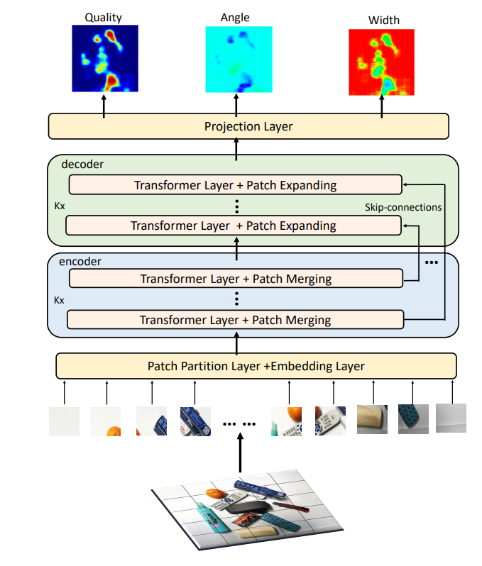

## When Transformer Meets Robotic Grasping: Exploits Context for Efficient Grasping Detection

PyTorch implementation of paper "When Transformer Meets Robotic Grasping:
Exploits Context for Efficient Grasping Detection"

## Visualization of the architecture

<br>

This code was developed with Python 3.6 on Ubuntu 16.04.  Python requirements can installed by:

```bash
pip install -r requirements.txt
```

## Datasets

Currently, both the [Cornell Grasping Dataset](http://pr.cs.cornell.edu/grasping/rect_data/data.php),
[Jacquard Dataset](https://jacquard.liris.cnrs.fr/) , and [GraspNet 1Billion](https://graspnet.net/datasets.html)  are supported.

### Cornell Grasping Dataset
1. Download the and extract [Cornell Grasping Dataset](http://pr.cs.cornell.edu/grasping/rect_data/data.php). 

### Jacquard Dataset

1. Download and extract the [Jacquard Dataset](https://jacquard.liris.cnrs.fr/).

### GraspNet 1Billion dataset

1. The dataset can be downloaded [here](https://graspnet.net/datasets.html).
2. Install graspnetAPI following [here](https://graspnetapi.readthedocs.io/en/latest/install.html#install-api).

   ```bash
   pip install graspnetAPI
   ```   
3.  We use the setting in [here](https://github.com/ryanreadbooks/Modified-GGCNN) 


## Training

Training is done by the `main.py` script.  

Some basic examples:

```bash
# Train  on Cornell Dataset
python main.py   --dataset cornell

# k-fold training
python main_k_fold.py  --dataset cornell 

#  GraspNet 1
python main_grasp_1b.py 
```

Trained models are saved in `output/models` by default, with the validation score appended.

## Visualize
Some basic examples:
```bash
# visulaize grasp rectangles
python visualise_grasp_rectangle.py   --network your network address

# visulaize heatmaps
python visulaize_heatmaps.py  --network your network address

```


## Running on a Robot

Our ROS implementation for running the grasping system see [https://github.com/USTC-ICR/SimGrasp/tree/main/SimGrasp](https://github.com/USTC-ICR/SimGrasp/tree/main/SimGrasp).

The original implementation for running experiments on a Kinva Mico arm can be found in the repository [https://github.com/dougsm/ggcnn_kinova_grasping](https://github.com/dougsm/ggcnn_kinova_grasping).

## Acknowledgement
Code heavily inspired and modified from https://github.com/dougsm/ggcnn

If you find this helpful, please cite
```bash
@ARTICLE{9810182,
  author={Wang, Shaochen and Zhou, Zhangli and Kan, Zhen},
  journal={IEEE Robotics and Automation Letters}, 
  title={When Transformer Meets Robotic Grasping: Exploits Context for Efficient Grasp Detection}, 
  year={2022},
  volume={},
  number={},
  pages={1-8},
  doi={10.1109/LRA.2022.3187261}}

```
